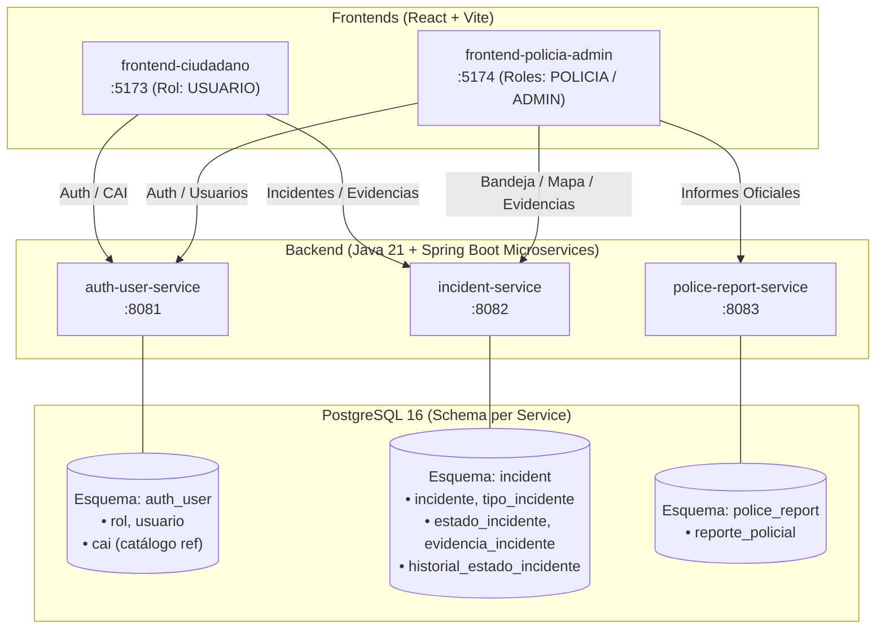

# Entornos Seguros - Plataforma de Reporte y Gestión Ciudadana

[](https://github.com/)
[](https://www.oracle.com/java/)
[](https://spring.io/projects/spring-boot)
[](https://react.dev/)
[](https://vitejs.dev/)
[](https://www.postgresql.org/)
[](LICENSE)

Plataforma integral y distribuida para la gestión, geolocalización, atención y trazabilidad de incidentes de seguridad ciudadana. Diseñada bajo una arquitectura desacoplada de microservicios con persistencia *schema-per-service* sobre PostgreSQL y dos aplicaciones frontend independientes desarrolladas en React.

---

## 📌 Tabla de Contenidos

- [1. Resumen de Arquitectura](#1-resumen-de-arquitectura)
- [2. Mapeo de Servicios y Puertos](#2-mapeo-de-servicios-y-puertos)
- [3. Estructura del Monorepo](#3-estructura-del-monorepo)
- [4. Pila Tecnológica](#4-pila-tecnológica)
- [5. Guía Rápida de Inicio (Quickstart)](#5-guía-rápida-de-inicio-quickstart)
  - [5.1. Infraestructura con Docker](#51-infraestructura-con-docker)
  - [5.2. Ejecución del Backend (Java/Gradle)](#52-ejecución-del-backend-javagradle)
  - [5.3. Ejecución de los Frontends (React/Vite)](#53-ejecución-de-los-frontends-reactvite)
- [6. Funcionalidades y Cobertura End-to-End](#6-funcionalidades-y-cobertura-end-to-end)
- [7. Modelo de Seguridad y Roles](#7-modelo-de-seguridad-y-roles)
- [8. Documentación Complementaria](#8-documentación-complementaria)

---

## 1. Resumen de Arquitectura

El sistema se compone de dos capas principales completamente desacopladas que se comunican mediante HTTP REST / JSON asegurado por JSON Web Tokens (JWT):



### Principios Clave de Diseño
1. **Schema-per-Service:** Una única instancia de PostgreSQL aloja esquemas aislados (`auth_user`, `incident`, `police_report`). Cada microservicio es dueño exclusivo de sus tablas.
2. **Desacoplamiento Relacional:** Las referencias inter-servicio (p. ej. `idUsuario` en un incidente, o `idIncidente` en un informe policial) son estrictamente identificadores lógicos sin claves foráneas físicas entre esquemas.
3. **Seguridad Stateless:** Tokens JWT firmados que viajan en la cabecera estándar `Authorization: Bearer <token>` para todas las operaciones protegidas.

---

## 2. Mapeo de Servicios y Puertos

| Componente | Tipo | Puerto Local | Descripción Principal |
| :--- | :--- | :---: | :--- |
| **frontend-ciudadano** | Web App (React) | `5173` | Registro, reporte ciudadano, seguimiento, perfil y mapa de CAIs. |
| **frontend-policia-admin** | Web App (React) | `5174` | Panel policial (mapa operativo, reportes) y panel admin (gestión de usuarios e incidentes). |
| **auth-user-service** | Microservicio (Spring Boot) | `8081` | Autenticación, gestión de usuarios, roles y catálogo de CAIs (PostGIS). |
| **incident-service** | Microservicio (Spring Boot) | `8082` | Registro de incidentes, evidencias, catálogo de tipos/estados y cambios de estado. |
| **police-report-service** | Microservicio (Spring Boot) | `8083` | Formalización de la atención policial y emisión de informes oficiales. |
| **PostgreSQL** | Base de Datos | `5432` | Motor relacional con esquemas `auth_user`, `incident` y `police_report`. |
| **Redis** | Caché | `6379` | Soporte de caché para sesiones y operaciones concurrentes. |
| **pgAdmin** | GUI DB Admin | `5050` | Administrador visual de PostgreSQL. |

---

## 3. Estructura del Monorepo

```text
TFM---Entornos-Seguros/
├── backend/                         # Backend Java Multi-módulo con Gradle Wrapper
│   ├── auth-user-service/           # Microservicio de identidad y catálogo CAI (:8081)
│   ├── incident-service/            # Microservicio de gestión de incidentes y evidencias (:8082)
│   ├── police-report-service/       # Microservicio de reportes oficiales de policía (:8083)
│   ├── build.gradle                 # Configuración compartida de Gradle
│   ├── settings.gradle              # Definición de submódulos
│   ├── gradlew / gradlew.bat        # Gradle Wrapper
│   └── README.md                    # Documentación técnica del backend
├── frontend-ciudadano/              # Aplicación React para la ciudadanía (:5173)
│   ├── src/
│   │   ├── pages/                   # Vistas: Auth, Reportes, Detalle, Mapa CAI, Perfil
│   │   ├── services/                # Clientes API REST (auth, incidentes, CAI, geolocalización)
│   │   └── components/              # Componentes UI encapsulados
│   └── README.md
├── frontend-policia-admin/          # Aplicación React para Policía y Administradores (:5174)
│   ├── src/
│   │   ├── pages/                   # Vistas Policiales (/reportes, /mapa) y Admin (/admin/*)
│   │   ├── services/                # Clientes API REST (authService, policeApi, adminUsersApi)
│   │   └── components/              # Componentes (ProtectedRoute, UsersTable, UserReportCard, etc.)
│   └── README.md
├── docs/                            # Documentación técnica detallada
│   ├── ARCHITECTURE.md              # Blueprint de arquitectura, esquemas DB y patrones
│   ├── API.md                       # Especificación de contratos REST y DTOs
│   ├── MICROSERVICES_ENDPOINTS.md   # Catálogo detallado de endpoints con ejemplos cURL
│   └── SETUP.md                     # Guía integral de instalación y configuración
├── database/                        # Scripts SQL y esquemas de base de datos
├── docker-compose.yml               # Orquestación local de PostgreSQL, Redis y pgAdmin
├── PROJECT_STRUCTURE.md             # Descripción canónica de estructura de archivos
├── PROJECT_SUMMARY.md               # Resumen ejecutivo y estado del proyecto
└── README.md                        # Entrada principal al proyecto
```

---

## 4. Pila Tecnológica

### Backend & Datos
- **Lenguaje:** Java 21 LTS
- **Framework:** Spring Boot 3.2.x (Spring Web, Spring Security, Spring Data JPA, Actuator)
- **Seguridad:** JSON Web Tokens (jjwt 0.12.x), BCrypt password hashing
- **Base de Datos:** PostgreSQL 16 (con extensiones espaciales PostGIS)
- **Gestión de Construcción:** Gradle 8.x con Gradle Wrapper multi-módulo

### Frontend
- **Librería UI:** React 19.x
- **Empaquetador:** Vite 8.x
- **Enrutamiento:** React Router DOM v7
- **Mapas Geoespaciales:** Leaflet 1.9.x + React-Leaflet 5.x (OpenStreetMap)
- **Iconografía & Gráficas:** Lucide React, Recharts 3.x

---

## 5. Guía Rápida de Inicio (Quickstart)

### Requisitos Previos
- **Java Development Kit (JDK):** 21 o superior
- **Node.js:** 20.x o superior (con npm 10+)
- **Docker & Docker Compose:** Versión moderna

---

### 5.1. Infraestructura con Docker

Levanta la base de datos PostgreSQL, Redis y pgAdmin:

```bash
docker compose up -d
```

> **Verificación:** Verifica que el contenedor `entornos-seguros-db` esté saludable en el puerto `5432`.

---

### 5.2. Ejecución del Backend (Java/Gradle)

Abre una terminal en el directorio `backend/` y ejecuta los tres microservicios (en terminales separadas o usando tu IDE):

```bash
# Terminal 1 - Auth & Users Service (Puerto 8081)
cd backend
./gradlew :auth-user-service:bootRun

# Terminal 2 - Incident Service (Puerto 8082)
cd backend
./gradlew :incident-service:bootRun

# Terminal 3 - Police Report Service (Puerto 8083)
cd backend
./gradlew :police-report-service:bootRun
```

*En Windows PowerShell puedes usar `.\gradlew.bat :<servicio>:bootRun`.*

---

### 5.3. Ejecución de los Frontends (React/Vite)

Abre terminales dedicadas para cada aplicación frontend:

```bash
# Frontend Ciudadano (Puerto 5173)
cd frontend-ciudadano
npm install
npm run dev

# Frontend Policía / Administrador (Puerto 5174)
cd frontend-policia-admin
npm install
npm run dev
```

---

## 6. Funcionalidades y Cobertura End-to-End

| Área Funcional | Vista / Ruta | Microservicio Consumido | Estado de Integración |
| :--- | :--- | :--- | :---: |
| **Registro & Login Ciudadano** | `/login`, `/register` | `auth-user-service` (:8081) | ✅ 100% Real API |
| **Perfil Ciudadano** | `/profile` | `auth-user-service` (:8081) | ✅ 100% Real API |
| **Mapa Ciudadano de CAIs** | `/mapa-cai` | `auth-user-service` (:8081) | ✅ 100% Real API (PostGIS) |
| **Creación de Incidentes & Evidencias** | `/report` | `incident-service` (:8082) | ✅ 100% Real API |
| **Historial & Detalle de Incidentes** | `/reports`, `/reports/:id` | `incident-service` (:8082) | ✅ 100% Real API |
| **Login Policía / Admin** | `/login` (Port 5174) | `auth-user-service` (:8081) | ✅ 100% Real API |
| **Bandeja de Casos Policiales** | `/reportes` | `incident-service` (:8082) | ✅ 100% Real API |
| **Detalle de Incidente Policial** | `/reportes/:id` | `incident-service` (:8082) | ✅ 100% Real API (Evidencias Reales) |
| **Atención & Cierre Policial** | `/reportes/:id/generar-informe` | `police-report-service` (:8083) + `incident-service` | ✅ 100% Real API |
| **Mapa Operativo Policial** | `/mapa` | `incident-service` (:8082) | ✅ 100% Real API (Límites Bogotá) |
| **Gestión Administrativa de Usuarios** | `/admin/gestion-usuarios`, `/admin/crear-usuario` | `auth-user-service` (:8081) | ✅ 100% Real API (CRUD) |
| **Detalle Administrativo de Incidentes** | `/admin/incidentes/:id` | `incident-service` + `police-report-service` | ✅ 100% Real API |

---

## 7. Modelo de Seguridad y Roles

El control de acceso basado en roles (RBAC) está implementado tanto en el backend (`Spring Security`) como en el frontend (`ProtectedRoute`):

```text
USUARIO       --> Acceso exclusivo a frontend-ciudadano (reportar, ver mis reportes, perfil, mapa CAI).
POLICIA       --> Acceso a frontend-policia-admin: /, /reportes, /reportes/:id, /mapa, /reportes/:id/generar-informe.
ADMINISTRADOR --> Acceso a frontend-policia-admin: /admin, /admin/crear-usuario, /admin/gestion-usuarios, /admin/incidentes, /admin/incidentes/:id.
```

- **Tokens:** JWT HMAC-SHA256 con tiempo de expiración configurable.
- **Almacenamiento Local:** Clave canónica `entornos_auth` en `localStorage`.
- **Cierre de Sesión:** Limpieza centralizada mediante `clearSession()` y redirección inmediata a `/login`.

---

## 8. Documentación Complementaria

Para profundizar en aspectos específicos del sistema, consulta los siguientes documentos en la carpeta [`docs/`](docs/):

- 📘 [**Arquitectura y Diseño Técnico (ARCHITECTURE.md)**](docs/ARCHITECTURE.md): Diagramas de secuencia, esquemas relacionales, justificación de patrones y catálogo CAI.
- 📡 [**Especificación de APIs y DTOs (API.md)**](docs/API.md): Contratos de endpoints, modelos JSON, códigos de respuesta y mapeo frontend.
- 💻 [**Catálogo Operativo de Endpoints (MICROSERVICES_ENDPOINTS.md)**](docs/MICROSERVICES_ENDPOINTS.md): Comandos cURL listos para probar, payloads y detalles de implementación.
- 🛠️ [**Guía de Instalación y Despliegue (SETUP.md)**](docs/SETUP.md): Configuración de variables de entorno, Docker, base de datos y comandos de compilación.
- 📁 [**Estructura del Proyecto (PROJECT_STRUCTURE.md)**](PROJECT_STRUCTURE.md): Árbol detallado de archivos y responsabilidades de componentes.
- 🤝 [**Guía de Contribución (CONTRIBUTING.md)**](CONTRIBUTING.md): Flujo de trabajo Git, convenciones de commit y buenas prácticas.

---

**Entornos Seguros** | Trabajo de Fin de Máster (TFM) - 2026