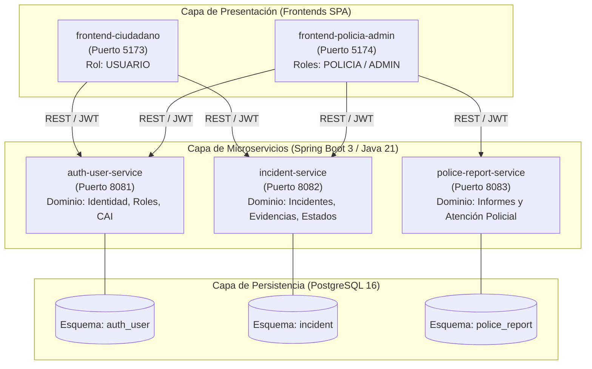
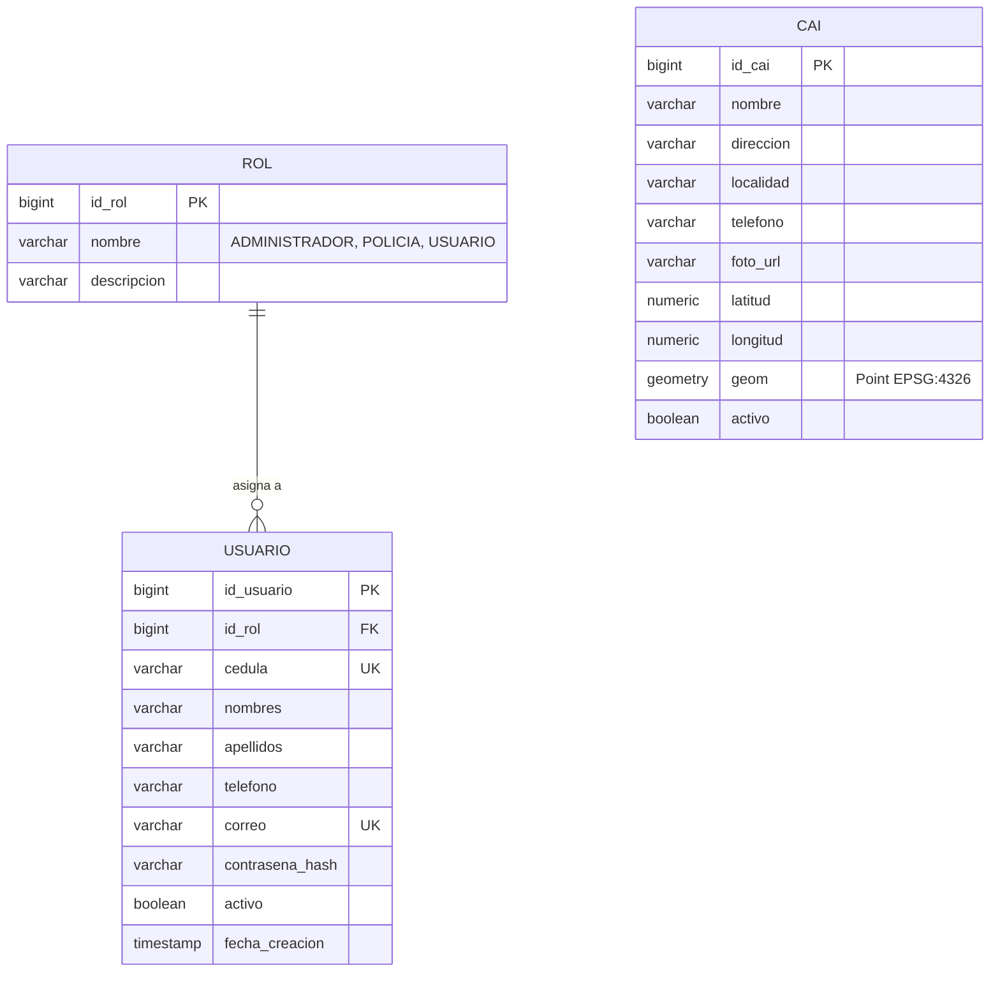
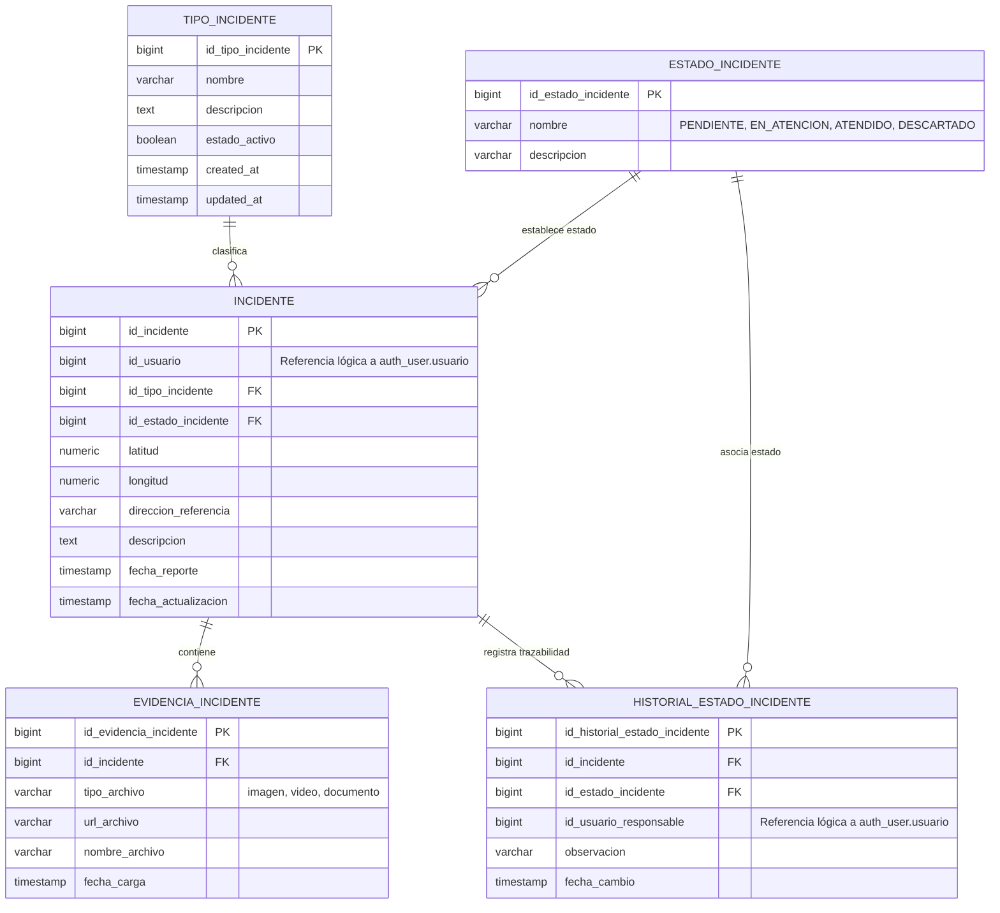
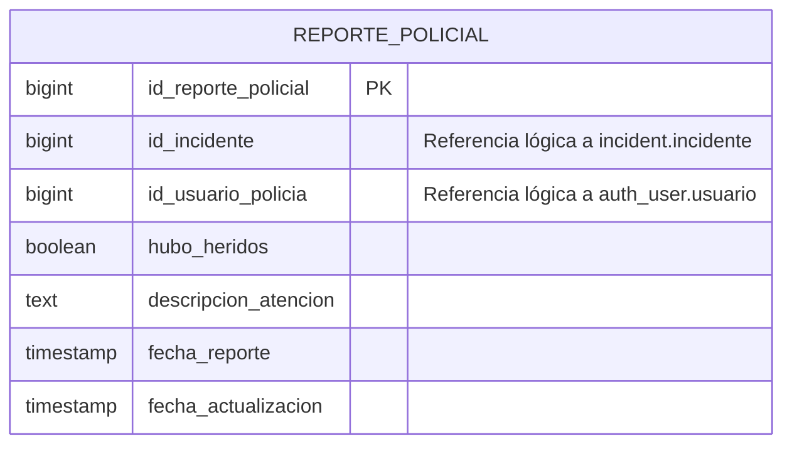
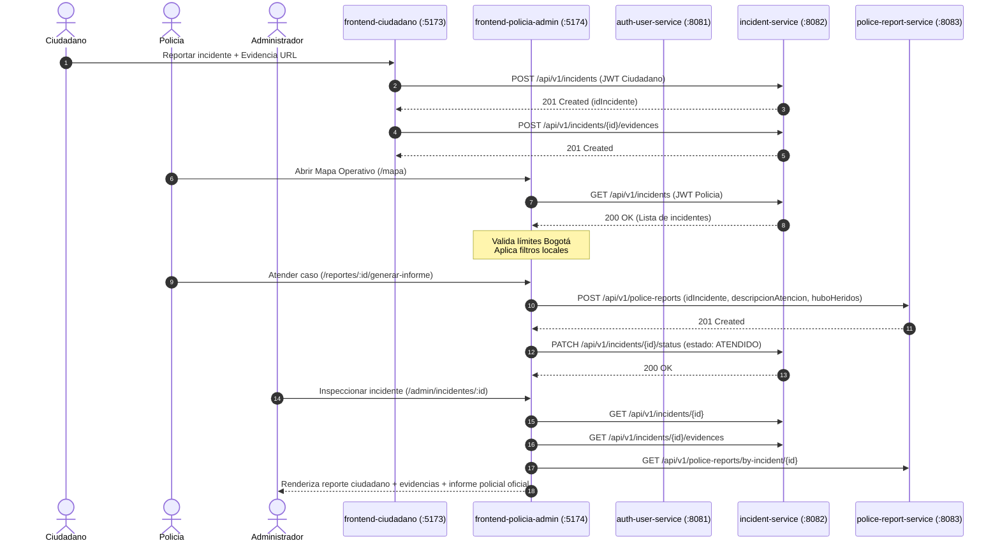

# Arquitectura del Sistema - Entornos Seguros

Este documento define la arquitectura técnica formal, la estrategia de persistencia desacoplada, el modelo de datos por microservicio y los patrones de integración del proyecto **Entornos Seguros**.

---

## 1. Visión General y Justificación

El sistema adopta una **arquitectura de microservicios** en el backend combinada con **dos aplicaciones frontend desacopladas en React (Vite)**. El objetivo es maximizar la modularidad, permitir el desarrollo y evolución independiente de cada dominio funcional, y garantizar una clara separación de responsabilidades.

---

## 2. Estrategia de Persistencia: *Schema-per-Service*

En arquitecturas distribuidas, el patrón canónico es **Database-per-Service**, donde cada microservicio es dueño exclusivo de sus datos y los expone únicamente a través de su API REST.

Para el contexto del Trabajo de Fin de Máster (TFM) y equilibrando rigor arquitectónico con viabilidad operativa:
- Se implementa una **única instancia de PostgreSQL**.
- La separación lógica estricta se logra mediante **esquemas dedicados (*schemas*)**:
  1. `auth_user` para `auth-user-service`
  2. `incident` para `incident-service`
  3. `police_report` para `police-report-service`

### Reglas de Desacoplamiento de Datos
- **Sin Foreign Keys Físicas Inter-Esquema:** Las tablas del esquema `incident` o `police_report` **nunca** definen constraints `FOREIGN KEY` hacia tablas del esquema `auth_user`.
- **Referencias Lógicas:** La asociación entre un incidente y su creador se realiza mediante el campo `id_usuario` (identificador lógico `BIGINT`). La asociación entre un reporte policial y el agente se realiza mediante `id_usuario_policia`.
- **Independencia Evolutiva:** Cada servicio puede alterar sus tablas o migrar a una base de datos física independiente sin afectar la integridad relacional de los demás.

---

## 3. Modelo de Datos por Esquema

### 3.1. Esquema `auth_user` (auth-user-service)

Representa el dominio de identidad, autenticación, control de acceso y catálogo geográfico de referencia.

#### Descripción de Entidades:
- **`rol`:** Catálogo de perfiles funcionales del sistema (`ADMINISTRADOR`, `POLICIA`, `USUARIO`).
- **`usuario`:** Cuentas autenticables con credenciales encriptadas mediante BCrypt y control de estado activo/inactivo.
- **`cai`:** *(Excepción controlada)* Catálogo estático de Centros de Atención Inmediata con capacidades geoespaciales (PostGIS).

---

### 3.2. Esquema `incident` (incident-service)

Constituye el núcleo operativo ciudadano para el reporte, categorización, evidencias y ciclo de vida del incidente.

---

### 3.3. Esquema `police_report` (police-report-service)

Registra la formalización oficial de la intervención policial sobre un caso reportado.

---

## 4. Flujo y Ciclo de Vida del Incidente

El siguiente diagrama de secuencia ilustra la interacción integral entre los actores, los dos frontends y los tres microservicios:

---

## 5. Seguridad y Autenticación

### 5.1. Mecanismo de Autenticación
1. **Emisión:** `auth-user-service` valida credenciales (email + contraseña con BCrypt) y emite un JWT firmado con algoritmo HMAC-SHA256 (`HS256` / `HS512`).
2. **Payload del Token:** Contiene `sub` (email), `userId` (idUsuario), `role` (`ROLE_ADMIN`, `ROLE_POLICIA`, `ROLE_USUARIO`), `iat` y `exp`.
3. **Propagación:** Cada petición HTTP del cliente incluye la cabecera `Authorization: Bearer <token>`.
4. **Validación Stateless:** Cada microservicio valida la firma del token utilizando la misma clave secreta compartida (`JWT_SECRET`).

### 5.2. Aislamiento de Rutas en Frontend (`ProtectedRoute`)
En `frontend-policia-admin`, las rutas se protegen mediante validación estricta de rol:
- **`POLICIA`:** Acceso a `/`, `/reportes`, `/mapa`, `/reportes/:id`, `/reportes/:id/generar-informe`.
- **`ADMIN`:** Acceso a `/admin`, `/admin/crear-usuario`, `/admin/gestion-usuarios`, `/admin/editar-usuario/:id`, `/admin/incidentes`, `/admin/incidentes/:id`.
- **Redirección:** Intentos de acceso cruzado redirigen al dashboard correspondiente del rol sin ejecutar peticiones no autorizadas.

---

## 6. Decisiones Arquitectónicas Notables

### D-01: Catálogo de CAIs en `auth_user`
- **Contexto:** El TFM modela 3 microservicios principales. Se requería un catálogo de 156+ CAIs de Bogotá para soporte geográfico.
- **Decisión:** Alojar la tabla `cai` en el esquema `auth_user` y exponerla desde `auth-user-service`.
- **Justificación:** Los datos de CAI son estáticos, de solo lectura, y no pertenecen al dominio de incidentes ni de reportes policiales. Crear un cuarto microservicio añadiría sobrecarga operativa innecesaria para el alcance del proyecto.

### D-02: Bounding Box Geográfico de Bogotá
- **Contexto:** El mapa ciudadano y el mapa operativo policial deben restringirse a la jurisdicción de Bogotá D.C.
- **Decisión:** Configurar límites geográficos estrictos (`BOGOTA_BOUNDS = [[4.47, -74.25], [4.83, -74.0]]`) con `maxBoundsViscosity=1.0` en Leaflet.
- **Justificación:** Previene navegación fuera de la zona de interés operativo e identifica incidentes con coordenadas inválidas o externas mediante avisos contextuales accesibles.

---

**Entornos Seguros** | Documentación de Arquitectura Técnica - 2026